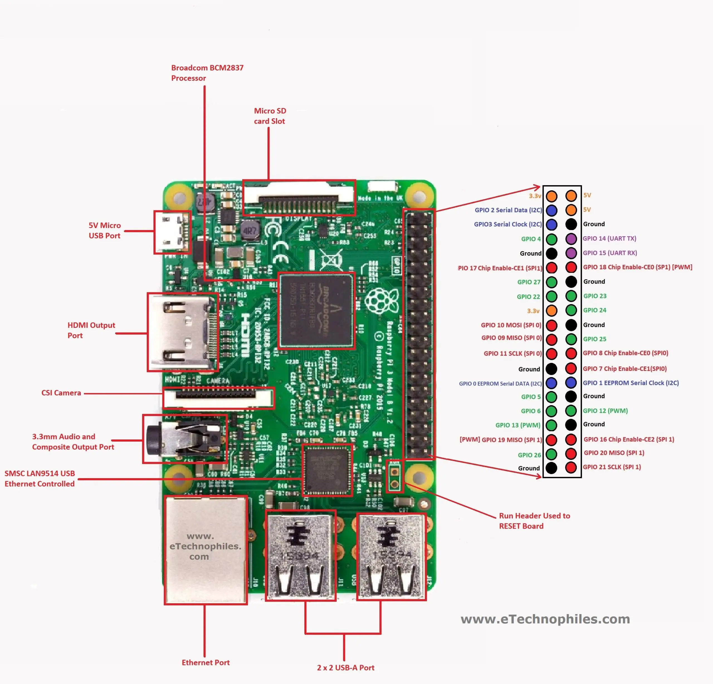

# Introduction

This repository has been developed to cover the embedded systems lecture at the International Summer School at Jade University 2023. The repository will guide us along several topics until we develop a final project. 

Thus, the main idea is to become familiar with the Raspberry Pi Single Board Computer (SBC) and learn different methods of programming the device and get access to the hardware available by learning: 

1. SSH connection with PuTTy
2. Basic Shell commands
3. Basic configuration and use of `apt`
4. Installing applications (Vim)
5. Configuring Vim
6. Git commands
7. ESP32??? or  accessing ports and sensors
8. NodeJS


# Accessing the RPi4 by ssh

The SBC can be accessed by the `ssh` protocol if it is enabled (disabled by default at Raspberry). Thus, we need to know the SBC's IP or hostname and own a username with a password. 

*By default, the RPi's hostname is `raspberry,` but the username and password are defined during the image creation process by the user ([raspberry Pi imager](link)).*

Then, to make ssh, use:
```
$ ssh username@hostname.local  
```
or 
```
$ ssh username@ip
```


# Basic commands on the Bash 

Next are listed the most common commands on the bash-shell:

- `ls` list files in the current path
- `touch` creates a file in the current path
- `rm` removes a file or folder (requires arguments)
- `mkdir` creates a folder in the current path (requires arguments)
- `cd` change directory (requires arguments)
- `cp` copy file/folder (requires arguments)

**--Let us practice the commands on the bash terminal--**

# GPIO from bash

To access RBPi's GPIO hardware from programs, there are various tools and methods available. However, using `sysfs` is a straightforward approach that is backed by the **Linux kernel** and enables the devices to be visible from the file system. This allows users to work from the command line (terminal) without the need to develop any code. For basic applications, the `sysfs` method is ideal, as it can be used interactively or by incorporating the commands into shell scripts.

`sysfs` is a pseudo filesystem provided by the **Linux kernel** that makes information about various kernel subsystems, hardware devices, and device drivers available in user space through virtual files. The GPIO devices appear as part of `sysfs`.

## First steps

The system has some `sysfs` GPIO drivers already loaded, you can search for them at `/sys/class/gpio/`:

```
ls /sys/class/gpio
export  gpiochip0  gpiochip504  unexport
```

We'll look at how to use this interface next. **Note that the device names starting with "gpiochip" are the GPIO controllers and we won't directly use them.**

Next, the basic steps to enable a GPIO pin from the `sysfs` interface are:

1. Export the pin.
2. Set the pin direction (input or output).
3. If there is an output pin, set the level to low or high.
4. If there is an input pin, read the pin's level (low or high).
5. When the gpio is not used anymore, it is recommended to unexport the pin.

Thus, to make available the GPIO24 as an output and write a logic 1, we execute at the terminal:

Export the GPIO24 by

```
echo 24 >> /sys/class/gpio/export
```

then, the `gpio24` linksys file is available at

```
ls /sys/class/gpio/
export  gpio24  gpiochip0  gpiochip504  unexport
```

you can go now and observe inside the `gpio24` folder a series of configuration files

```
ls /sys/class/gpio/gpio24/
active_low  device  direction  edge  power  subsystem  uevent  value
```

the ones that we require for now are the `direction` and `value`, then, to make the GPIO24 an output write a logic 1 (3V):

```
echo out >> /sys/class/gpio/gpio24/direction
echo 1 >> /sys/class/gpio/gpio24/value
```

## Raspberry Pi 3 pinout



# RPi4 configuration

Once you can connect or get in into the SBC, a basic configuration and package installation is required. The next sections will guide you to install Vim, configure the SBC's hostname, the user password, internet access and time, and finally install a useful bash tool.

## Updating the system and installing Vim

Before any further changes, please update the system and packages by:

```
$ sudo apt update
$ sudo apt list --upgradable
```
and then make the upgrade of all required packages
```
$ sudo apt upgrade
Reading package lists... Done
Building dependency tree
Reading state information... Done
Calculating upgrade... Done
The following packages will be upgraded:
  bb-customizations bbb.io-kernel-4.19-ti bbb.io-kernel-tasks dirmngr gnupg gnupg-l10n gnupg-utils gpg gpg-agent
    gpg-wks-client gpg-wks-server gpgconf gpgsm gpgv libcpupower1 linux-cpupower linux-libc-dev
	17 upgraded, 0 newly installed, 0 to remove and 0 not upgraded.
	Need to get 9908 kB of archives.
	After this operation, 69.6 kB of additional disk space will be used.
	Do you want to continue? [Y/n] Y
	...
	...
	...
```

Now we can start to install updated packages. Let us install the `Vim` application to use as our main source and text editor:
```
$ sudo apt install vim
```

## Vim editor and commands

Put here information about Vim and its usage...

## Changing the RPi4's hostname

First, edit the `/etc/hostname` file by:
```
$ sudo vim /etc/hostname
```

Change the first and only line in this file to reflect your new hostname. 

Then, edit the `/etc/hosts` file:
```
127.0.0.1       localhost
127.0.1.1       hostname.localdomain    hostname

# The following lines are desirable for IPv6 capable hosts
::1     localhost ip6-localhost ip6-loopback
ff02::1 ip6-allnodes
ff02::2 ip6-allrouters
```
change the second line in both `hostname` instances (127.0.1.1) for your new hostname; must be the same as previously defined.  

Finally, reboot your device.

## Changing the user's password

To change the logged-in user's password, use the following:
```
$ passwd
Changing password for debian.
Current password: temppwd
New password: xxxxxxx
```

## Time and Internet access
We previously checked the internet access to our SBC devices, now, let us use the internet to sync our time zone and locales for the further sync of commits in the git system. 

Thus, let us check the time at the device by:
```
$ date
$ systemctl status time-sync.target
```
if the time is wrong, use the next command and follow the instructions:
```
$ sudo dpkg-reconfigure tzdata
```
then the system will have the correct time now.

If locale settings fail, use:
```
$ sudo dpkg-reconfigure locales
```
and choose your desired locales, it is recommended to use international English with UTF-8 compatibility.

## Oh My Bash tool

Next, to make easier work with the bash system, let us install the oh-my-bash tool:
```
$ bash -c "$(curl -fsSL https://raw.githubusercontent.com/ohmybash/oh-my-bash/master/tools/install.sh)"
```
you can go deeper and customize the themes and plugins at [oh-my-bash web page](https://ohmybash.nntoan.com/).

# SSH Key pairs (optional)

To create key pairs for SSH, use:
```
$ ssh-keygen -t ed25519 -C "your_email@example.com"
```
then copy the `*.pub` file generated with:
```
$ ssh-copy-id -i ~/.ssh/id_ed25519.pub debian@bbb-marx.local
/usr/bin/ssh-copy-id: INFO: Source of key(s) to be installed: "/Users/gmarx/.ssh/id_ed25519.pub"
/usr/bin/ssh-copy-id: INFO: attempting to log in with the new key(s), to filter out any that are already installed ...
```

---

# Git tool
In 2005, *Linus Torvalds* created Git, a version controlling system specifically for developing the Linux Kernel.

Let us start by specifying the Git configuration settings with the `git config` command. Thus, one of the first things you need is to set up your name and email address:
```
git config --global user.name "John Doe"
git config --global user.email johndoe@example.com
```
also, you can set the main editor or client to commit:
```
git config --global core.editor vim
```

Now, try to create a new repository with two files: file-a and file-b, add some lines of code, and make a commit. Next, make some changes, and only commit the changes on file-a, the changes on file-b restore them to the previous commit.

## Github
- Create an account in [Github](https://github.com)
- Create ssh-key pairs in the RPi4 and save the `*.pub` content at [SSH keys](https://github.com/settings/keys)
- Create a remote repository and follow the instructions to upload your local copy
- Check the remote repository

# Starting with the ESP32 
The next section will introduce the basics of programming the ESP32 with the Arduino IDE. The first code allows using the GPIOs, serial communication, Wi-Fi, and finally, the MQTT protocol. 